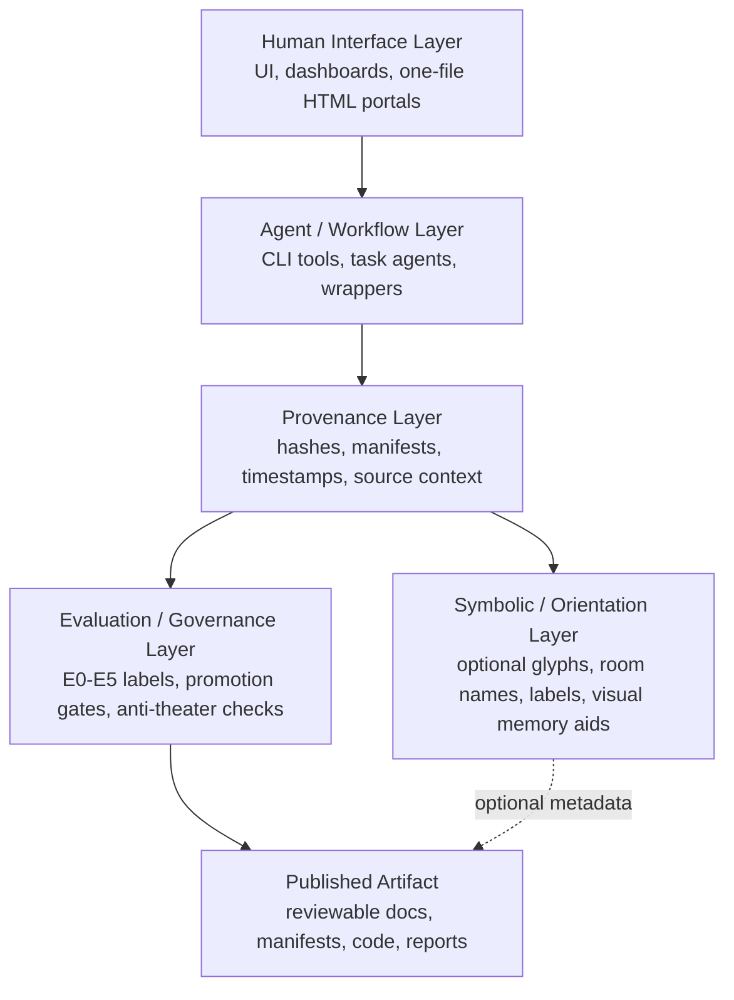
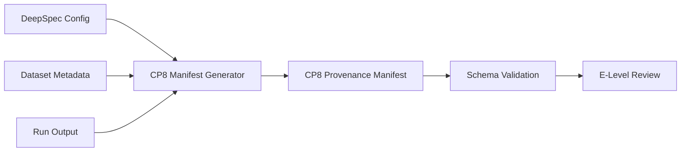

# CP8 Data Flow

This document defines the working interaction model between the five CP8 layers.

## Five-Layer Flow

## Runtime Assumption

The first executable CP8 implementation uses a simple file-based runtime:

1. A user or wrapper script points CP8 at one or more input files.
2. `cp8/provenance_manifest.py` computes hashes and file metadata.
3. The script writes a JSON provenance manifest.
4. The manifest can be validated against the JSON Schema.
5. Human reviewers or CI checks use the manifest to support evidence promotion.

## Layer Interface Definitions

### Human Interface -> Agent / Workflow

Initial interface: CLI invocation or static HTML dashboard reading JSON files.

Future interface: REST endpoint or task-runner adapter.

### Agent / Workflow -> Provenance

Initial interface: local files and manifest generation.

Required fields:

- input path
- SHA-256 hash
- file size
- modified timestamp
- artifact family
- source context
- evidence level

### Provenance -> Evaluation / Governance

The governance layer reads the manifest and decides whether an artifact can claim a given E-level.

### Symbolic / Orientation -> Other Layers

The symbolic layer is optional. It may provide labels, categories, icons, glyph tags, or UX motifs. It must not override hashes, evidence labels, test results, or reproduction requirements.

## DeepSpec Integration Candidate

## Boundary

CP8 wraps DeepSpec artifacts with provenance and governance metadata. It does not claim to improve DeepSpec's speculative decoding performance unless separately benchmarked and reproduced.
